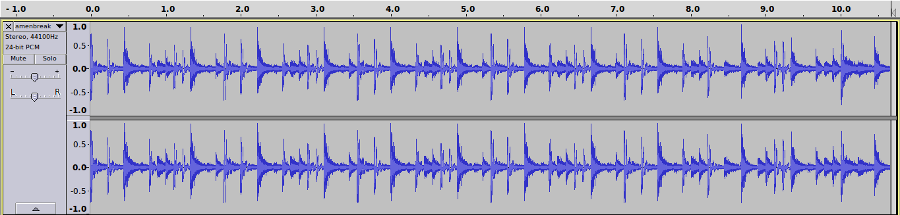
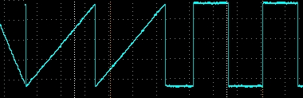
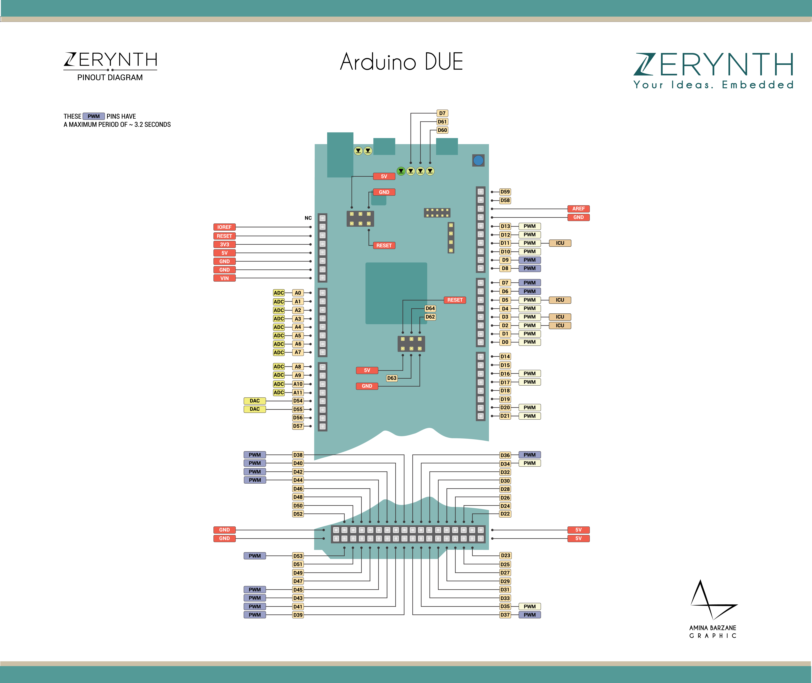

% Processamento de Áudio com Arduino Due
% Lucas Fialho Zawacki

Jabá Matehackers
=

\centerline{\includegraphics[height=1.5in]{assets/images/logo.png}}

## **Hackers + Espaço = Hackerspace**

<http://matehackers.org>

Quem sou?
=

* Lucas Fialho Zawacki
* Ciêntista da Computação, [Matehackers](https://matehackers.org), [Mconf](https://mconf.com)
* [Musical Aritfacts](https://musical-artifacts.com), [Ownlife Project](https://ownlife.lfzawacki.com/)

O que queremos fazer aqui?
=

* Usar um Arduino Due como processador de sinais digitais
* Aprender como funciona áudio e áudio digital
* Fazer os nossos próprios efeitos de áudio baseados no som de uma guitarra

O que queremos fazer aqui? (cont.)
=

Processamento de Sinais Digitais (DSP)
=

1. Fonte sonora
1. Onda elétrica
1. Conversão Analógico-Digital (ADC)
1. **Código (manipulação digital dos dados)**
1. Conversão Digital-Analógica (DAC)
1. Saída de Som (caixas de som, fones-de-ouvido)

Diagrama DSP
=

](assets/images/dsp.png)

Como funcionam ondas sonoras
=

* Váriação de pressão do ar
* Frequência da variação -> "Nota"
* Amplitude -> "Volume"
* Podemos converter ondas sonoras (mecânicas) em ondas eletricas

Ondas Sonoras
=

Áudio Digital
=

* Representação numérica de uma frequência elétrica
* É feita como uma amostragem de partes da onda original...
* Virando uma sequência de números no tempo

Taxa de Amostragem
=

Qual a influência da taxa de amostragem?

11025 KHz
<audio data-src="assets/sounds/amenbreak-less.ogg" type="audio/ogg" controls="controls"></audio>

44100 KHz
<audio data-src="assets/sounds/amenbreak.ogg" type="audio/ogg" controls="controls"></audio>

Diferentes Ondas
=

* Seno, Triângulo, Quadrada, Dente de Serra, Pulso, ...
* ... o resto!

 

Arduino Due
=

* Arduino Baseado no Atmel SAM3X8E ARM Cortex-M3 CPU
* 32 bits, mais memória, mais processador
* Muito mais inputs e outputs
* DACs e ADCs

Pinagem Arduino Due
=

Demonstração do DAC
=

* <https://gist.github.com/pklaus/5921022>

Projeto inspirador
=

<iframe width="860" height="560" src="https://www.youtube.com/embed/COPaqJBekBQ" frameborder="0" allow="autoplay; encrypted-media" allowfullscreen></iframe>

Circuito
=

* Um amplificador baseado no Fetzer Valve com MPF102
* <http://www.runoffgroove.com/fetzervalve.html>

Voltagem e PCM
=

* Amplificação e amostragem do sinal de guitarra
* Valores variando entre 900 e 1400
* Um pouco de ruído
* Porém temos o nosso som!

Código
=

Demos
=

* Guitarra limpa
* Distorção
* Córus + Distorção

Dúvidas
=

Muito Obrigado
=

:)